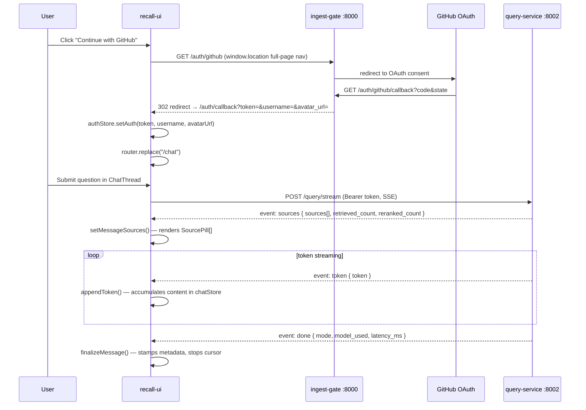

# recall-ui — Architecture Documentation

**Stack:** Next.js 16 App Router · React 19 · TypeScript · Tailwind CSS · Zustand

---

## Overview

`recall-ui` is the developer-facing web client for **Recall**, an AI Second Brain that performs RAG over a developer's GitHub repositories. It talks to two backend FastAPI services:

- **ingest-gate** (default port 8000) — GitHub OAuth, auto-sync, webhook registration
- **query-service** (default port 8002) — synchronous and SSE-streamed RAG queries

The UI is a developer tool with a Linear/Vercel aesthetic: dark-mode-first, zinc palette, monospace accents. Primary surfaces are a chat thread (streaming answers with source pills), a Cmd+K command palette, and a sidebar showing GitHub source status and conversation history.

---

## Service Topology

```
recall-ui (port 3000)
  │
  ├──► ingest-gate :8000   /auth/github (OAuth flow)
  │                        /auth/github/callback (handled by backend → redirects to UI)
  │
  └──► query-service :8002  POST /query          (sync, used by Cmd+K)
                             POST /query/stream   (SSE, used by chat)
```

---

## Page Structure (App Router)

```
src/app/
  layout.tsx              Root layout: dark theme, global styles, CommandMenu mount
  page.tsx                / → redirects to /chat (if authenticated) or /login
  login/
    page.tsx              GitHub OAuth button + manual JWT paste fallback
  auth/
    callback/
      page.tsx            Reads ?token=&username=&avatar_url= from URL, persists to store, redirects /chat
  chat/
    layout.tsx            AuthBoundary + AppSidebar + main column layout
    page.tsx              Creates/selects active thread, renders ChatThread
  settings/
    page.tsx              Account info (username, JWT preview, thread count) + danger zone (wipe local data)
```

No `/sources` page exists yet — connected repos are inferred from the `username` in the auth store and displayed statically in the sidebar.

---

## Component Hierarchy

```
RootLayout
  CommandMenu (Cmd+K, globally mounted)
  /login         → LoginPage
  /auth/callback → CallbackPage
  ChatLayout
    AuthBoundary (redirects to /login if unauthenticated)
    AppSidebar
      [logo + new-chat button]
      [Cmd+K quick-search hint button]
      SidebarSources   — static source status: GitHub (connected/disconnected), Teams/Jira (soon)
      SidebarThreads   — thread list from chatStore; delete thread on hover
      [user avatar + username]
      [Settings link]
      [Sign out button]
    main
      ChatThread
        MessageBubble (user message)
        MessageBubble (assistant — streaming aware)
          MessageSkeleton   — shown while retrieving sources
          SourcePill[]      — rendered above the answer once sources arrive
          Markdown
            CodeBlock       — syntax highlight + copy button
          StreamingCursor   — blinking caret while isStreaming
        ChatInput           — fixed-bottom textarea, mode toggle (standard/complex), submit
      EmptyState            — shown on a fresh thread with no messages
```

---

## Data Flow



Auth fallback: if ingest-gate still returns JSON from the callback, the `/login` page offers a manual token + username paste form.

---

## State Management (Zustand)

### `useAuthStore` — persisted as `recall-auth`

```ts
{
  token: string | null;
  username: string | null;
  avatarUrl: string | null;
  setAuth(token, username, avatarUrl?): void;
  clearAuth(): void;
  isAuthenticated(): boolean;
}
```

Hydrated from `localStorage` on mount. All API clients read `token` from this store. A `401` from any endpoint calls `clearAuth()` and redirects to `/login`.

### `useChatStore` — persisted as `recall-chat-v1`

```ts
{
  threads: Thread[];
  activeThreadId: string | null;
  mode: QueryMode;          // "standard" | "complex" — persisted
  filters: QueryFilters;    // persisted
  isStreaming: boolean;     // not persisted

  createThread(): string;
  setActiveThread(id): void;
  deleteThread(id): void;
  addMessage(threadId, message): void;
  appendToken(threadId, messageId, token): void;
  setMessageSources(threadId, messageId, sources): void;
  setMessageRetrieving(threadId, messageId, value): void;
  finalizeMessage(threadId, messageId, metadata): void;
  setMessageError(threadId, messageId, error): void;
  setMode(mode): void;
  setFilters(filters): void;
  setIsStreaming(value): void;
  getActiveThread(): Thread | null;
}
```

Thread titles are auto-derived from the first user message (first 60 chars). IDs use a `Date.now() + random` pattern (no external library).

---

## API Client Structure

```
src/lib/
  api/
    types.ts          — QueryRequest, QueryResponse, SourceChunk, SSEEvent types
    queryService.ts   — queryOnce() for sync /query (used by CommandMenu)
    sse.ts            — streamQuery() — fetch + ReadableStream SSE parser
  auth/
    token.ts          — thin helpers to read/write/clear token from authStore
    oauth.ts          — buildGitHubLoginUrl() constructs the OAuth start URL
```

### SSE Client (`lib/api/sse.ts`)

`EventSource` is not used — it cannot send `Authorization` headers and is GET-only. Instead, `streamQuery()` uses:

1. `fetch(POST /query/stream, { headers: { Authorization: Bearer ... } })`
2. `res.body.getReader()` — streams raw bytes
3. A line-by-line buffer parser that parses `event:` / `data:` pairs and calls the appropriate callback
4. An `AbortController` signal — passed in and checked; `AbortError` is swallowed silently

Callbacks: `onSources`, `onToken`, `onDone`, `onError`.

---

## Auth Flow

```mermaid
flowchart LR
    A[/login\nContinue with GitHub] -->|window.location nav| B[GET /auth/github]
    B --> C[GitHub consent]
    C --> D[GET /auth/github/callback\non ingest-gate]
    D -->|302 redirect| E[/auth/callback?token=&username=&avatar_url=]
    E --> F[authStore.setAuth\nlocalStorage recall-auth]
    F --> G[router.replace /chat]
    D -->|if backend returns JSON| H[user copies token]
    H --> I[/login → Paste token form]
    I --> F
```

The `/auth/callback` page reads `useSearchParams()`, validates the token is present, calls `authStore.setAuth()`, then calls `router.replace("/chat")`. The `?token=` param is removed from history by `replace` so it does not persist in the browser history.

---

## Component Inventory

| Component | File | Notes |
|-----------|------|-------|
| `ChatThread` | `components/chat/ChatThread.tsx` | Renders the active thread's message list + `ChatInput`. Scroll behavior: smooth-scrolls on new message (messages.length change); instant-scrolls during streaming to follow token output without animation jitter. |
| `MessageBubble` | `components/chat/MessageBubble.tsx` | User and assistant message variants; assistant includes sources, streaming cursor, markdown |
| `MessageSkeleton` | `components/chat/MessageSkeleton.tsx` | Shown when `retrieving=true` (waiting for sources event) |
| `SourcePill` | `components/chat/SourcePill.tsx` | `[owner/repo: file.py]` badge shown above the answer |
| `StreamingCursor` | `components/chat/StreamingCursor.tsx` | Blinking caret rendered while `isStreaming=true` |
| `ChatInput` | `components/chat/ChatInput.tsx` | Textarea + standard/complex mode toggle + submit button |
| `EmptyState` | `components/chat/EmptyState.tsx` | Shown when a new thread has no messages |
| `AppSidebar` | `components/layout/AppSidebar.tsx` | Full sidebar: logo, new-chat, Cmd+K hint, sources, threads, user footer |
| `SidebarSources` | `components/layout/SidebarSources.tsx` | GitHub (connected if username present), Teams/Jira (coming soon) |
| `SidebarThreads` | `components/layout/SidebarThreads.tsx` | Thread list with delete affordance |
| `AuthBoundary` | `components/layout/AuthBoundary.tsx` | Client gate: pushes to `/login` if `!isAuthenticated()` |
| `CommandMenu` | `components/command/CommandMenu.tsx` | Cmd+K palette — navigation and quick search |
| `Markdown` | `components/markdown/Markdown.tsx` | `react-markdown` + `remark-gfm` |
| `CodeBlock` | `components/markdown/CodeBlock.tsx` | `react-syntax-highlighter` (Prism) + copy button |

---

## Key Dependencies

| Package | Version | Role |
|---------|---------|------|
| `next` | `^16.2.6` | App Router framework |
| `react` / `react-dom` | `^19.0.0` | UI runtime |
| `zustand` | `^5.0.3` | State management + persist middleware |
| `tailwindcss` | `^3.4.17` | Utility-first CSS |
| `cmdk` | `^1.0.4` | Cmd+K command palette |
| `lucide-react` | `^0.469.0` | Icon set |
| `react-markdown` | `^9.0.1` | Markdown rendering |
| `react-syntax-highlighter` | `^15.6.1` | Code block syntax highlighting |
| `remark-gfm` | `^4.0.0` | GFM tables/strikethrough in markdown |
| `tailwind-merge` | `^2.6.0` | Conditional class merging |
| `clsx` | `^2.1.1` | Class list composition |
| Radix UI primitives | various | Dialog, Tooltip, ScrollArea, Avatar, etc. |

Notable absences from the original design: `nanoid`, `sonner`, `next-themes`, `react-hook-form`, `zod`, `rehype-raw` are **not** installed.

---

## Environment Variables

| Variable | Default | Purpose |
|----------|---------|---------|
| `NEXT_PUBLIC_INGEST_GATE_URL` | `http://localhost:8000` | Base URL for ingest-gate (OAuth + setup endpoints) |
| `NEXT_PUBLIC_QUERY_SERVICE_URL` | `http://localhost:8002` | Base URL for query-service (RAG query endpoints) |

---

## Design Decisions

| Decision | Rationale |
|----------|-----------|
| **Token in `localStorage` (persist key `recall-auth`)** | Keeps the UI fully decoupled from the backend domain; avoids cross-domain cookie configuration. Trade-off: any XSS yields token theft. Acceptable for a single-developer tool. |
| **POST + `fetch` / `ReadableStream` for SSE** | `EventSource` cannot send `Authorization` headers and is GET-only. Manual line-by-line SSE parser is ~50 LOC and fully typed. |
| **Client-side-only thread persistence** | Zero backend work; threads stored in `localStorage` via Zustand persist. Lost on device change — acceptable for v1. |
| **`useChatStore.isStreaming` not persisted** | Streaming state is transient and should not survive a page reload (would leave the UI stuck with a spinning cursor). |
| **Mostly Client Components** | The chat surface is inherently interactive; routing through RSC would add complexity with no payoff. Static shell (layout, login) uses server components. |
| **Sources inferred, not fetched** | No dedicated "list repos" endpoint exists. `SidebarSources` shows GitHub as connected if `username` is set in `authStore`; other integrations (Teams, Jira) are placeholders. |
| **Scroll behavior during streaming** | Two separate scroll effects in `ChatThread`: smooth scroll triggers only on `messages.length` change (new message added); instant scroll triggers during active streaming. Calling `scrollIntoView({ behavior: 'smooth' })` on every token append caused the browser to repeatedly cancel and restart a 300ms animation, producing visible jitter. |
