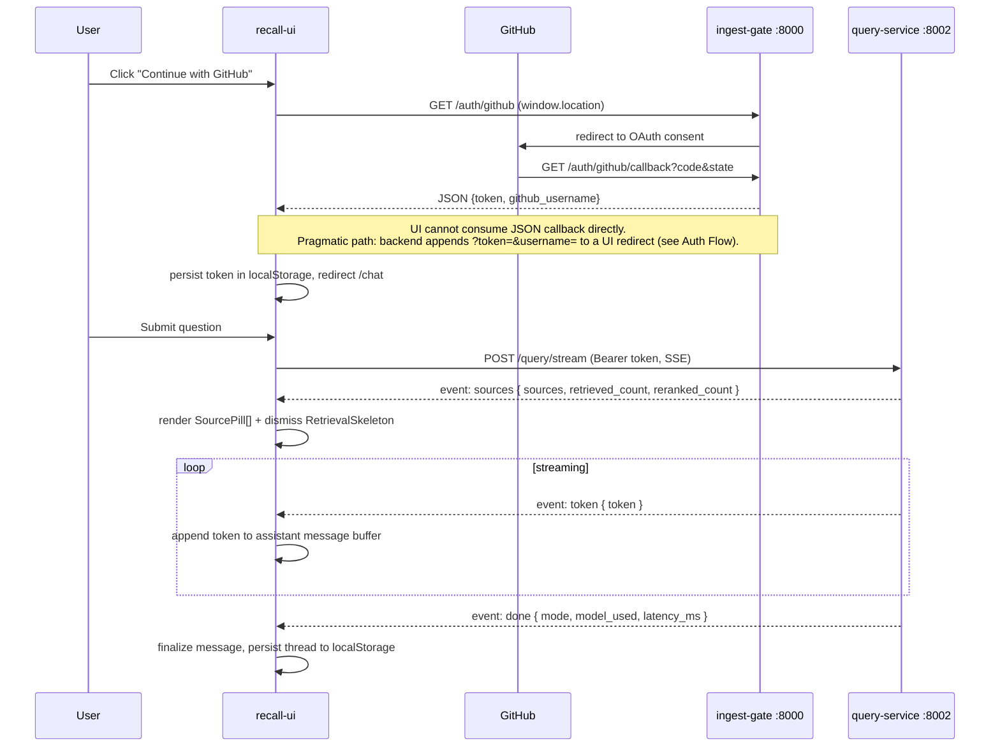
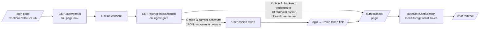

# Recall — Pre-Implementation Design

## recall-ui (Next.js 15 App Router Frontend) — 2026-05-27

### Overview

`recall-ui` is the developer-facing web client for **Recall**, an AI Second Brain that performs RAG over a developer's GitHub repositories. It is a separate deployable that lives at `/Users/mahmudulkhan/Downloads/projects/recall/recall-ui/` and talks to two existing FastAPI services:

- `ingest-gate` (port 8000): GitHub OAuth + webhook registration
- `query-service` (port 8002): synchronous + SSE-streamed RAG queries

The UI is a developer tool with a Linear/Vercel aesthetic: dark-mode-first, zinc palette, monospace accents, terse density. Primary surfaces are a chat thread (streaming answers with source pills), a Cmd+K command palette for quick semantic search, and a sidebar showing GitHub source status and recent threads.

### Assumptions & Constraints

**Assumptions**
- The two backend services are deployed somewhere reachable; the UI is configured via two env vars: `NEXT_PUBLIC_INGEST_GATE_URL`, `NEXT_PUBLIC_QUERY_SERVICE_URL`.
- Backend services already implement CORS for the UI origin. If not, that is a backend change, not a UI change.
- The OAuth callback currently returns **JSON** rather than redirecting. The UI cannot consume an HTML JSON page directly. Two viable paths exist; we choose the **token-in-query-param** path (see Auth Flow) as the pragmatic minimum-change option, with a **manual token paste** fallback so users are never stuck.
- Chat threads are stored **client-side only (localStorage)** in v1. The backend has no thread/conversation persistence endpoint today, and inventing one is out of scope for the UI plan.
- All RAG state (history, retrieval, reranking) is owned by `query-service`; the UI is a thin streaming client and renderer.
- Single-user-per-browser; no team workspaces, no shared threads.
- Node 20+, pnpm preferred (works with npm/yarn).

**Constraints**
- Next.js 15 App Router, TypeScript `strict: true`.
- Tailwind CSS + Shadcn UI (Radix primitives), `cmdk`, `zustand`, `react-syntax-highlighter`, `react-markdown`.
- Token persisted in `localStorage` (per requirements). This is an explicit trade-off: see Risks.
- Streaming must be token-by-token using the SSE contract above.

### Architecture Design

#### File / Folder Structure

```
recall-ui/
  .env.local.example
  .eslintrc.json
  .gitignore
  .prettierrc
  next.config.ts
  tailwind.config.ts
  postcss.config.mjs
  tsconfig.json
  components.json                  # shadcn config
  package.json
  pnpm-lock.yaml
  README.md
  public/
    favicon.svg
    logo.svg
  src/
    app/
      layout.tsx                   # root layout: fonts, ThemeProvider, Toaster, AuthBoundary
      globals.css                  # Tailwind base + zinc tokens + scrollbar styles
      page.tsx                     # redirects: / -> /chat (if authed) or /login
      loading.tsx
      error.tsx
      not-found.tsx
      login/
        page.tsx                   # "Continue with GitHub" + manual token paste fallback
      auth/
        callback/
          page.tsx                 # reads ?token=&username=, persists, redirects to /chat
      chat/
        layout.tsx                 # sidebar + main split (client boundary for shortcuts)
        page.tsx                   # empty-state landing for new thread
        [threadId]/
          page.tsx                 # renders a single thread (messages from store)
      sources/
        page.tsx                   # repo connection management UI
      settings/
        page.tsx                   # token, theme, danger zone (wipe local data)
      api/
        health/route.ts            # GET /api/health (UI self-check; optional)
    components/
      ui/                          # shadcn primitives (button, input, dialog, dropdown,
                                   # tooltip, scroll-area, separator, skeleton, toast,
                                   # command, popover, sheet, badge, avatar, kbd)
      layout/
        AppSidebar.tsx
        SidebarNav.tsx
        SidebarSources.tsx         # GitHub source status list
        SidebarThreads.tsx         # recent threads (from store)
        TopBar.tsx                 # model badge, user avatar, settings link
        AuthBoundary.tsx           # client gate: if no token, push to /login
      chat/
        ChatThread.tsx             # virtualized message list (centered, max-w-3xl)
        MessageBubble.tsx          # user vs assistant variants
        AssistantMessage.tsx       # streaming-aware markdown renderer
        SourcePill.tsx             # [GitHub: auth.py] pill, opens drawer
        SourceDrawer.tsx           # Sheet showing chunk_text + blob_url
        ChatInput.tsx              # fixed-bottom textarea, mode toggle, top_k slider
        ModeToggle.tsx             # standard | complex
        StreamingCursor.tsx        # blinking caret while streaming
        RetrievalSkeleton.tsx      # skeleton bars while sources event pending
        EmptyState.tsx             # suggestions on a fresh thread
      markdown/
        Markdown.tsx               # react-markdown + remark-gfm wrapper
        CodeBlock.tsx              # react-syntax-highlighter + copy button
        InlineCode.tsx
      command/
        CommandMenu.tsx            # cmdk Dialog, mounted in root layout
        CommandGroups.tsx          # navigation, recent threads, quick query
      common/
        CopyButton.tsx
        KbdHint.tsx
        ErrorBanner.tsx
        Spinner.tsx
    lib/
      api/
        client.ts                  # fetch wrapper: base URL, auth header, error normalization
        ingestGate.ts              # auth + setup endpoints
        queryService.ts            # sync query
        sse.ts                     # streamQuery(): fetch + ReadableStream SSE parser
        types.ts                   # SourceChunk, QueryRequest, QueryResponse, SSEEvent
      auth/
        token.ts                   # get/set/clear token + username in localStorage
        oauth.ts                   # buildLoginUrl(), parseCallbackParams()
      hooks/
        useAuth.ts
        useStreamQuery.ts          # subscribe to SSE, emit tokens into store
        useHotkeys.ts              # Cmd+K, Cmd+N, Cmd+/
        useAutoScroll.ts
      store/
        authStore.ts               # token, username, isAuthenticated
        chatStore.ts               # threads, activeThreadId, append/stream actions
        uiStore.ts                 # commandOpen, sidebarCollapsed, theme
        persist.ts                 # zustand persist middleware for chat + auth
      utils/
        cn.ts                      # tailwind-merge + clsx
        ids.ts                     # nanoid wrapper for thread/message ids
        time.ts                    # relative time formatter
        markdown.ts                # extract source refs, sanitize
        env.ts                     # zod-validated runtime env
    styles/
      themes.css                   # zinc tokens, mono font vars
    types/
      sse.ts
      chat.ts
      global.d.ts
```

#### Component Hierarchy

```
RootLayout
  ThemeProvider (next-themes, dark default)
  AuthBoundary
    CommandMenu (Cmd+K, globally mounted)
    Toaster
    /login            -> LoginPage (GitHub button + manual token paste)
    /auth/callback    -> CallbackPage (parses token, persists, redirects)
    ChatLayout
      AppSidebar
        SidebarNav
        SidebarSources    (lists connected repos from local cache)
        SidebarThreads    (recent threads from chatStore)
      Main
        TopBar
        Outlet:
          /chat                -> EmptyState + ChatInput
          /chat/[threadId]     -> ChatThread + ChatInput
          /sources             -> RepoConnectPanel + WebhookRegister
          /settings            -> TokenManager + Preferences

ChatThread
  MessageBubble (user)
  AssistantMessage
    RetrievalSkeleton (while awaiting `sources` event)
    SourcePill[]      (rendered above the answer once sources arrive)
    Markdown
      CodeBlock (syntax highlight + CopyButton)
    StreamingCursor
  SourceDrawer (Sheet, opened by SourcePill click)
```

#### Data Flow



Key flow rules:
- **One in-flight stream per thread.** A new submit aborts the prior `AbortController`.
- **Sources arrive before tokens.** UI shows skeleton until `sources`, then renders pills, then streams answer below.
- **`done` is authoritative** for stopping the cursor and stamping `model_used` / `latency_ms` on the message.
- **`error`** events flip the message into an error state with a retry affordance.

#### Data Models (client-side)

```ts
// src/lib/api/types.ts
export type SourceChunk = {
  chunk_text: string;
  file_path: string;
  repository_name: string;
  chunk_index: number;
  blob_url: string;
  author: string | null;
  commit_sha: string | null;
  relevance_score: number;
};

export type QueryMode = "standard" | "complex";

export type QueryRequest = {
  question: string;
  top_k?: number;             // 1..20
  mode: QueryMode;
  filters?: {
    repository_name?: string;
    file_format?: string;
    author?: string;
  };
};

export type QueryResponse = {
  answer: string;
  sources: SourceChunk[];
  mode: QueryMode;
  model_used: string;
  latency_ms: number;
  retrieved_count: number;
  reranked_count: number;
};

export type SSEEvent =
  | { event: "sources"; data: { sources: SourceChunk[]; retrieved_count: number; reranked_count: number } }
  | { event: "token";   data: { token: string } }
  | { event: "done";    data: { mode: QueryMode; model_used: string; latency_ms: number } }
  | { event: "error";   data: { detail: string } };

// src/types/chat.ts
export type Role = "user" | "assistant";

export type ChatMessage = {
  id: string;
  role: Role;
  content: string;                    // accumulated tokens for assistant
  sources?: SourceChunk[];
  status: "pending" | "streaming" | "complete" | "error";
  error?: string;
  modeUsed?: QueryMode;
  modelUsed?: string;
  latencyMs?: number;
  createdAt: number;
};

export type ChatThread = {
  id: string;
  title: string;                      // derived from first user message
  messages: ChatMessage[];
  createdAt: number;
  updatedAt: number;
  pinnedFilters?: QueryRequest["filters"];
};
```

#### Zustand Stores

```ts
// authStore.ts
{ token: string | null; username: string | null;
  setSession(token, username): void; clear(): void;
  isAuthenticated: boolean; }

// chatStore.ts   (persisted via zustand/middleware/persist -> localStorage key "recall.chat.v1")
{ threads: Record<string, ChatThread>;
  threadOrder: string[];
  activeThreadId: string | null;
  createThread(): string;
  appendUserMessage(threadId, content): string;        // returns messageId
  startAssistantMessage(threadId): string;
  appendToken(threadId, messageId, token): void;
  setSources(threadId, messageId, sources, counts): void;
  completeMessage(threadId, messageId, meta): void;
  failMessage(threadId, messageId, detail): void;
  renameThread(threadId, title): void;
  deleteThread(threadId): void; }

// uiStore.ts     (NOT persisted)
{ commandOpen: boolean; sidebarCollapsed: boolean;
  openCommand(): void; closeCommand(): void; toggleSidebar(): void; }
```

### API Surface the Frontend Calls

| Method | URL | Purpose | Auth |
|--------|-----|---------|------|
| GET    | `${INGEST_GATE}/auth/github` | Start OAuth (full page navigation) | none |
| GET    | `${INGEST_GATE}/auth/github/callback?code&state` | Handled by backend; UI never calls it directly | none |
| POST   | `${INGEST_GATE}/api/v1/setup/github/{owner}/{repo}/register` | Register repo webhook | Bearer |
| POST   | `${QUERY_SERVICE}/query` | Sync RAG query (used for Cmd+K quick-answer popover) | Bearer |
| POST   | `${QUERY_SERVICE}/query/stream` | SSE streamed RAG query (chat default) | Bearer |

SSE client implementation note: the backend uses POST + SSE. We do **not** use `EventSource` (it is GET-only and cannot send `Authorization` headers). Instead, we use `fetch` with a `ReadableStream` reader and parse the `event:`/`data:` lines manually in `lib/api/sse.ts`. Abort via `AbortController` on submit/unmount.

### Auth Flow

Because `ingest-gate` returns the token as **JSON** from the callback URL, the browser cannot pick it up out-of-band. We handle this with the **token-in-URL handoff** pattern requested, plus a **manual paste** fallback:



- **Recommended backend tweak (out of UI scope, but mentioned for completeness):** the callback should `RedirectResponse` to `${UI_BASE}/auth/callback?token=...&username=...`. Until then, the manual-paste fallback keeps the UI usable end-to-end.
- `/auth/callback/page.tsx` is a **client component** that reads `useSearchParams()`, validates the token shape, writes to `authStore`, then `router.replace("/chat")`. If params are missing, it shows an instruction card linking back to `/login`.
- `AuthBoundary` is a client component that subscribes to `authStore`; on any protected route, if `!isAuthenticated`, it pushes `/login`. The `/login` and `/auth/callback` routes are exempt.
- **Token storage:** `localStorage.setItem("recall.token", token)` (per requirements). All API clients read from `authStore` (which is hydrated from localStorage on mount). 401 from any endpoint clears the store and redirects to `/login`.
- **Logout:** Settings → "Sign out" calls `authStore.clear()` + wipes `recall.chat.v1` only if user confirms.

### Design Patterns & Technology Choices

| Concern | Choice | Why |
|---|---|---|
| Routing | App Router (RSC-aware) | Required; we keep most interactive pieces as client components since chat is fundamentally client-driven. Server components used for static shell only. |
| Styling | Tailwind + Shadcn UI (Radix) | Matches Linear/Vercel aesthetic; Shadcn gives us owned, themeable primitives without runtime CSS-in-JS cost. |
| State | Zustand (+ persist middleware) | Simpler than Redux, no provider boilerplate, plays well with RSC boundaries. Persist only chat + auth slices. |
| SSE | `fetch` + `ReadableStream` parser in `lib/api/sse.ts` | `EventSource` cannot send `Authorization` headers and is GET-only. Manual parsing is ~50 LOC and fully typed. |
| Markdown | `react-markdown` + `remark-gfm` | Streaming-safe; we re-render on each token without losing AST. |
| Code blocks | `react-syntax-highlighter` (Prism, ESM, async languages) | Lazy-load languages to avoid bloating bundle. |
| Command menu | `cmdk` | De facto for Cmd+K; pairs with Shadcn's `<Command>` wrapper. |
| Theming | `next-themes` | Dark-first; system as opt-in. |
| Forms / validation | `zod` + `react-hook-form` | Used for token paste + filter inputs. |
| Icons | `lucide-react` | Tree-shakable, Shadcn-default. |
| HTTP errors | Single `RecallApiError` thrown from `client.ts`; rendered by toast or inline banner. | Centralized 401 handling triggers `authStore.clear()`. |
| IDs | `nanoid` | Thread + message IDs. |
| Fonts | `Geist Sans` + `Geist Mono` via `next/font` | Vercel aesthetic, monospace for code. |

#### Package Dependencies (exact versions)

```json
{
  "dependencies": {
    "next": "15.1.6",
    "react": "19.0.0",
    "react-dom": "19.0.0",
    "typescript": "5.6.3",
    "zustand": "5.0.2",
    "cmdk": "1.0.4",
    "next-themes": "0.4.4",
    "react-markdown": "9.0.1",
    "remark-gfm": "4.0.0",
    "rehype-raw": "7.0.0",
    "react-syntax-highlighter": "15.6.1",
    "lucide-react": "0.469.0",
    "clsx": "2.1.1",
    "tailwind-merge": "2.5.5",
    "class-variance-authority": "0.7.1",
    "zod": "3.24.1",
    "react-hook-form": "7.54.2",
    "@hookform/resolvers": "3.9.1",
    "nanoid": "5.0.9",
    "sonner": "1.7.1",
    "@radix-ui/react-dialog": "1.1.4",
    "@radix-ui/react-dropdown-menu": "2.1.4",
    "@radix-ui/react-popover": "1.1.4",
    "@radix-ui/react-tooltip": "1.1.6",
    "@radix-ui/react-scroll-area": "1.2.2",
    "@radix-ui/react-separator": "1.1.1",
    "@radix-ui/react-slot": "1.1.1",
    "@radix-ui/react-avatar": "1.1.2",
    "@radix-ui/react-toast": "1.2.4"
  },
  "devDependencies": {
    "@types/node": "22.10.5",
    "@types/react": "19.0.2",
    "@types/react-dom": "19.0.2",
    "@types/react-syntax-highlighter": "15.5.13",
    "tailwindcss": "3.4.17",
    "tailwindcss-animate": "1.0.7",
    "postcss": "8.4.49",
    "autoprefixer": "10.4.20",
    "eslint": "9.17.0",
    "eslint-config-next": "15.1.6",
    "prettier": "3.4.2",
    "prettier-plugin-tailwindcss": "0.6.9"
  }
}
```

### Trade-offs

1. **Token in localStorage (XSS-exposed) vs. HttpOnly cookie.** Requirements specify localStorage, which keeps the UI fully decoupled from the backend domain and avoids CORS/cookie config. Cost: any XSS yields token theft. Mitigations: strict CSP, Trusted Types, no `dangerouslySetInnerHTML` outside the markdown renderer (which sanitizes), and `rehype-sanitize` in the markdown pipeline. If this product graduates beyond a single-developer tool, **move to HttpOnly SameSite=Lax cookies** and have the backend issue the cookie on callback.
2. **Token-in-URL handoff.** Convenient and unblocks the UI without altering JWT logic, but the token appears in browser history and possibly server access logs. Mitigation: `router.replace()` immediately after capture, single-use short-lived tokens on the backend roadmap. The manual-paste fallback exists precisely so we don't need to wait on a backend change to ship.
3. **Client-only thread persistence.** Zero backend work, instant UX, but threads are lost on browser/device change. Acceptable for v1 single-user tool; a future `/threads` service can layer on without UI refactor since the `chatStore` interface is the seam.
4. **POST + `fetch`/ReadableStream instead of EventSource.** Required for Bearer auth and POST bodies. Slightly more code; vastly more flexibility. We lose browser auto-reconnect on disconnect — we add a manual "retry" affordance instead, which is more honest for a chat UX than silent reconnection mid-answer.
5. **Mostly client components.** The chat surface is intrinsically interactive; pushing it through RSC would mean more wire boundaries with little payoff. We still keep the root layout, marketing-ish pages, and any future docs as server components.
6. **Shadcn (copy-in) vs. a packaged component lib.** Shadcn lets us own styles and match the zinc/Linear aesthetic precisely; the cost is slightly more files in `components/ui`. Worth it for a developer tool where visual identity matters.
7. **react-syntax-highlighter (Prism async) vs. Shiki.** Shiki produces nicer themes but is heavier and trickier with streaming partial code blocks. Prism async handles streaming well and is lighter. We can swap later behind `CodeBlock.tsx` if needed.

### Risks & Mitigations

| Risk | Impact | Mitigation |
|---|---|---|
| XSS exfiltrating the localStorage token | Account takeover | Strict CSP (`script-src 'self'`), no third-party inline scripts, `rehype-sanitize` for markdown, no `eval`. Document migration to HttpOnly cookies as the next-step. |
| OAuth callback returns JSON, not redirect | Users can't complete login | Implement `/auth/callback` page that reads `?token=&username=` AND ship manual-paste fallback in `/login`. File backend ticket for proper redirect. |
| SSE connection drops mid-stream | Partial answer + stuck cursor | Detect `reader.read()` returning `done` without a `done` event; mark message as `error` with retry button. AbortController on unmount. |
| Token leaks into URL history | Token theft via shared device | `router.replace()` to scrub query params immediately after persistence. |
| Markdown code blocks rendering before they're closed during streaming | Visual glitch / broken HTML | `react-markdown` re-parses on each token; we keep the fenced code state in a buffer and only highlight on `done`, showing plain mono text while streaming. |
| Bundle bloat from `react-syntax-highlighter` | Slow initial load | Use Prism light build with `PrismAsyncLight` and register only common languages (ts, tsx, js, py, go, rs, sh, sql, json, yaml, md). |
| 401 mid-session (expired JWT) | Confusing dead state | `client.ts` intercepts 401, clears auth store, toasts "Session expired", redirects to `/login`. |
| Multiple tabs writing the same persisted store | Last-write-wins corruption | Use Zustand `persist` with `storage` + a `version` bump strategy and a `BroadcastChannel`-based sync (small util in `store/persist.ts`). Acceptable to defer until reported. |
| Repository registration endpoint failing silently | User thinks repo is connected | `/sources` page shows per-repo status (pending → ok/failed), persists last-seen status in `uiStore` (non-persisted, refetched on mount). |
| Env vars missing in prod | Cryptic runtime errors | `lib/utils/env.ts` validates `NEXT_PUBLIC_*` with zod at module load and fails the app with a visible banner. |

### Implementation Roadmap

Ordered, parallelizable where noted.

1. **Scaffold (sequential)**
   - `pnpm create next-app@15 recall-ui --ts --app --tailwind --eslint --src-dir`
   - Configure `components.json`, install Shadcn primitives listed above.
   - Add `next-themes`, dark-mode default, zinc CSS tokens, Geist fonts.
   - Wire `lib/utils/env.ts` + `.env.local.example`.

2. **Core libs (parallelizable)**
   - 2a. `lib/api/client.ts` + `lib/api/types.ts` + `lib/api/ingestGate.ts` + `lib/api/queryService.ts`.
   - 2b. `lib/api/sse.ts` (fetch + ReadableStream + event parser) with unit-testable parser.
   - 2c. Zustand stores (`authStore`, `chatStore`, `uiStore`) + `persist.ts`.

3. **Auth surface (depends on 2a, 2c)**
   - `/login` page (GitHub button + manual paste).
   - `/auth/callback` page.
   - `AuthBoundary`, 401 interceptor.

4. **App shell (parallel with 3)**
   - `app/chat/layout.tsx` + `AppSidebar` + `TopBar`.
   - Empty `/chat` page with `EmptyState`.
   - Theme toggle in TopBar.

5. **Chat MVP (depends on 2b, 3, 4)**
   - `ChatInput` (textarea, mode toggle, top_k slider, submit + Cmd+Enter).
   - `ChatThread` + `MessageBubble`.
   - `AssistantMessage` wired to `useStreamQuery` → store actions.
   - `RetrievalSkeleton`, `StreamingCursor`, error retry.

6. **Markdown + sources (depends on 5)**
   - `Markdown.tsx` + `CodeBlock.tsx` (lazy-loaded languages) + `CopyButton`.
   - `SourcePill` + `SourceDrawer`.

7. **Cmd+K (depends on 2a, 5)**
   - `CommandMenu` globally mounted; groups for navigation, recent threads, "Quick ask" (uses `/query` sync endpoint and shows answer in popover; "Open as thread" CTA).

8. **Sources page (depends on 2a, 3)**
   - `/sources` page: input owner/repo → POST register → status row.

9. **Settings + polish**
   - Token reveal/copy/rotate, theme, wipe-local-data, hotkey cheatsheet.

10. **Hardening**
    - CSP headers via `next.config.ts`.
    - 401 + offline + stream-drop UX states.
    - Lighthouse pass; ensure no third-party requests besides backend.
    - Tab-sync via BroadcastChannel if needed.

### Open Questions

1. Can the backend be updated to **redirect** the OAuth callback to `${UI_BASE}/auth/callback?token=&username=` instead of returning JSON? If yes, the manual-paste fallback becomes deprecated (still ship it for emergencies).
2. Are there CORS allow-lists on `ingest-gate` and `query-service` for the UI's deployed origin? If not, who owns adding them?
3. Does `query-service` expose a list-repos / source-status endpoint? The sidebar's "GitHub source status" needs a data source; otherwise we infer connected repos lazily from the `repository_name` field on returned `SourceChunk`s.
4. Is there an existing JWT TTL? If short, do we need refresh-token UX or is "re-login on 401" acceptable for v1? (Recommendation: re-login for v1.)
5. Will threads ever be server-persisted? If yes within 1–2 quarters, we should design `chatStore` actions to mirror a future `/threads` REST shape now so the swap is mechanical.
